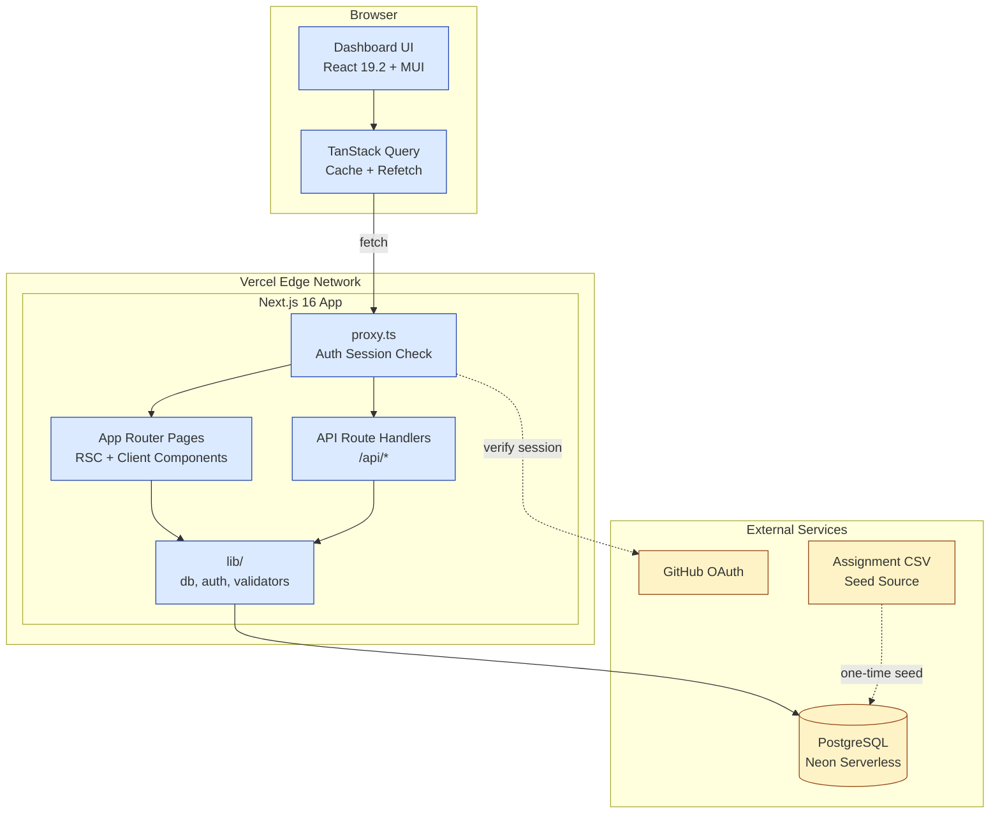
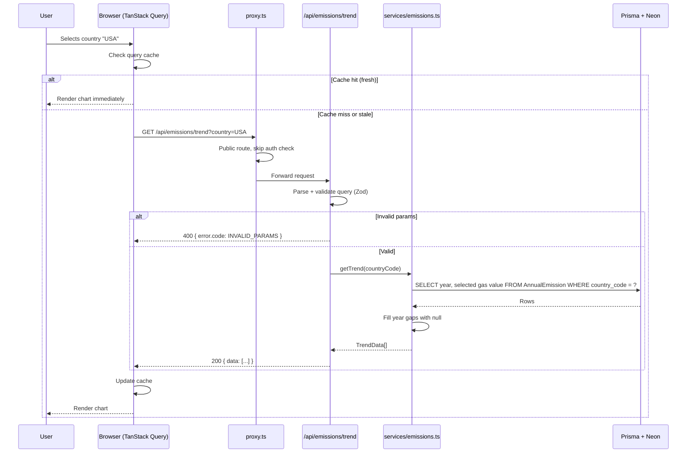
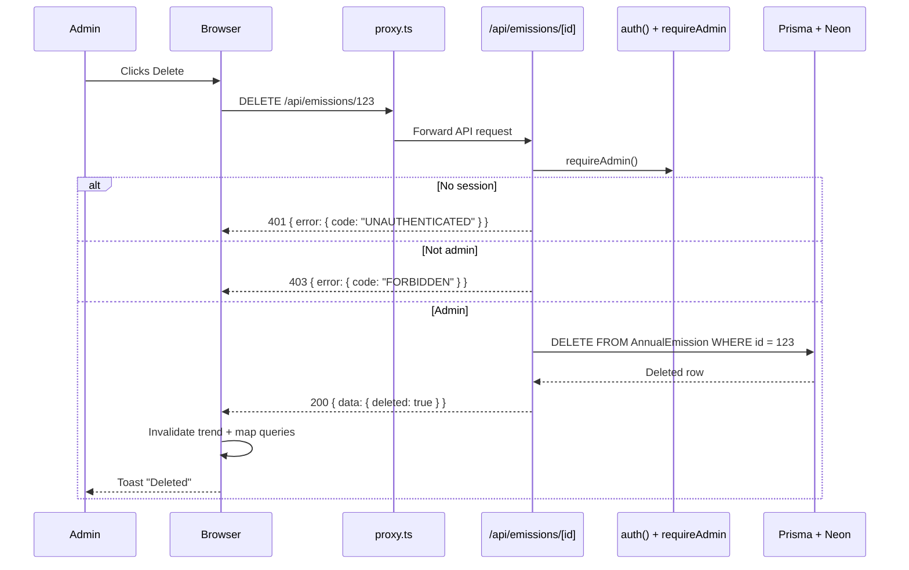
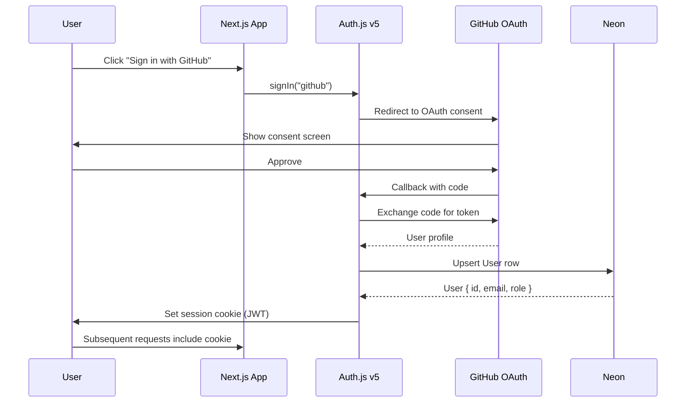
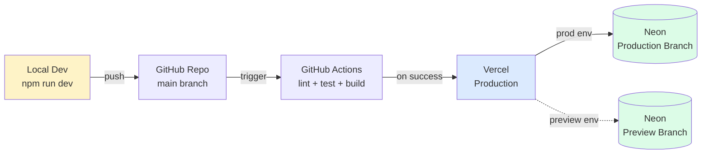

**Project:** Greenhouse Gas Emissions Dashboard & API
**Author:** Takoon

**Status:** Locked

---

# 1. System Overview
A single Next.js 16 application serves both the REST API and the dashboard UI, deployed to Vercel with PostgreSQL on Neon. The API exposes GHG emissions data seeded from the assignment CSV, with role-gated CRUD for admins. The dashboard consumes the same API as any external client would, keeping a clean boundary between data layer and presentation.

The architecture is monolithic for a 2-day build, but layered internally so that splitting API and UI into separate services later would not require rewriting business logic.

---

# 2. Architecture Diagram



**Reading the diagram:** The browser holds presentation state and a query cache. The Next.js app holds business logic, validation, and persistence. External services are isolated behind clear boundaries: Neon for data, GitHub for identity, the assignment CSV as a one-time seed source.

---

# 3. Layered Internal Structure
Within the Next.js app, code is organised in concentric layers:

```text
Presentation     app/(dashboard)/*      React components, charts, map
API              app/api/*/route.ts     Request parsing, response shaping
Validation       lib/schemas/*.ts       Zod schemas for input/output
Business         lib/services/*.ts      Domain logic (aggregation, rules)
Persistence      lib/db.ts + Prisma     Database access only
```

**Rule:** layers only call downward. Pages never touch Prisma directly. API routes never embed business logic. This keeps each file under 100 lines and each test focused on one concern.

Full folder structure lives in `01b — Conventions § File Structure`.

---

# 4. Request Lifecycle

## Read path: dashboard requests trend data



## Write path: admin deletes an emission record



**Why this matters:** the two flows show that authorisation happens at one chokepoint (`requireAdmin` helper), not scattered across handlers. Route handlers still enforce admin access and return standard JSON errors.

---

# 5. Authentication & Authorisation

## Flow



## Role Model
Two roles, defined as a Prisma enum:

```ts
enum Role {
  VIEWER  // default for new sign-ups, read-only
  ADMIN   // can CRUD emissions and countries
}
```

Promotion to ADMIN happens manually via a one-line SQL command, documented in the README. No self-service admin signup.

## Authorisation Pattern
A single helper enforces role at the route level:

```ts
// lib/auth/require-admin.ts
export async function requireAdmin() {
  const session = await auth();
  if (!session) throw new ApiError(401, "UNAUTHENTICATED");
  if (session.user.role !== "ADMIN") throw new ApiError(403, "FORBIDDEN");
  return session;
}
```

Every mutating route calls `requireAdmin()` as its first line. No try/catch in handlers; a top-level error mapper converts `ApiError` to JSON responses.

---

# 6. Deployment Topology



**Pipeline:**
1. Push to `main` triggers GitHub Actions
2. Actions run `lint`, `test`, `build` against a Neon test branch
3. On green, Vercel auto-deploys to production
4. PR branches deploy to Vercel preview URLs against Neon preview branches

**Environment variables:** managed via Vercel dashboard, mirrored locally in `.env.local`. Never committed. Reference list lives in `.env.example`.

---

# 7. Boundaries: Out of Scope
These are deliberately not built. Each is a 1-week extension from the current architecture, not a rewrite.

| Excluded | Why | How architecture supports adding it later |
| --- | --- | --- |
| Multi-tenant data isolation | Single-tenant is sufficient for the demo | Add `tenantId` column + Prisma middleware for RLS |
| Audit log for CRUD | Out of scope for 2 days | Wrap mutating service calls in an audit decorator |
| Server-side response cache (Redis) | Vercel edge cache + TanStack Query is enough at demo scale | Add `unstable_cache` wrappers to service functions |
| Rate limiting | Single-user demo, no abuse vector | Drop in `@upstash/ratelimit` at the proxy layer |
| Real-time updates | Out of scope; not in brief | Add Server-Sent Events route or Pusher integration |
| Internationalisation | English-only demo | Add `next-intl`, all UI strings already in components |

---

# 8. References
- Next.js 16 docs: https://nextjs.org/docs
- Auth.js v5: https://authjs.dev
- Prisma + Neon: https://neon.tech/docs/guides/prisma
- TanStack Query: https://tanstack.com/query/latest
- Sister docs:
  - `00 — PRD`
  - `01b — Conventions`
  - `01c — ADRs`
  - `02 — Data Model`
  - `03 — API Contracts`
