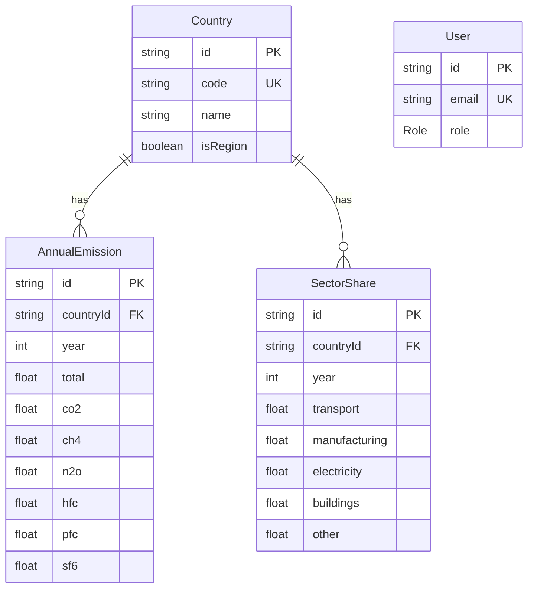

**Project:** Greenhouse Gas Emissions Dashboard & API
**Author:** Takoon

**Status:** Locked

---

# 1. Purpose
Define the database schema needed to support the app API, dashboard, seed data, and admin CRUD.

The model must support:
- countries list
- emissions trend by country
- emissions map by year
- sector breakdown by country and year
- gas filter by CO2, CH4, N2O, or total
- admin create/update/delete for emissions and country data

---

# 2. Source Data
The app uses the provided greenhouse gas emissions CSV as seed data.
The CSV is transformed during seeding. Its raw row/column structure is not used as the database model.

Seed target:
```plain text
Country
AnnualEmission
SectorShare
User
```

---

# 3. Prisma Schema
```prisma
generator client {
  provider = "prisma-client-js"
}

datasource db {
  provider = "postgresql"
  url      = env("DATABASE_URL")
}

enum Role {
  VIEWER
  ADMIN
}

model Country {
  id              String           @id @default(cuid())
  code            String           @unique
  name            String
  isRegion        Boolean          @default(false)

  annualEmissions AnnualEmission[]
  sectorShares    SectorShare[]

  @@index([name])
  @@index([isRegion])
}

model AnnualEmission {
  id        String  @id @default(cuid())

  countryId String
  country   Country @relation(fields: [countryId], references: [id], onDelete: Cascade)

  year      Int

  total     Float?
  co2       Float?
  ch4       Float?
  n2o       Float?
  hfc       Float?
  pfc       Float?
  sf6       Float?

  @@unique([countryId, year])
  @@index([year])
  @@index([countryId, year])
}

model SectorShare {
  id            String  @id @default(cuid())

  countryId     String
  country       Country @relation(fields: [countryId], references: [id], onDelete: Cascade)

  year          Int

  transport     Float?
  manufacturing Float?
  electricity   Float?
  buildings     Float?
  other         Float?

  @@unique([countryId, year])
  @@index([year])
  @@index([countryId, year])
}

model User {
  id    String @id @default(cuid())
  email String @unique
  role  Role   @default(VIEWER)
}
```

---

# 4. ER Diagram


`User` is not connected to the domain models. Admin access gates writes; users do not own emissions data.

---

# 5. Seed Mapping
The seed script maps known CSV series into app tables.

## AnnualEmission
```plain text
Total greenhouse gas emissions -> total
CO2 emissions -> co2
Methane emissions -> ch4
Nitrous oxide emissions -> n2o
HFC gas emissions -> hfc
PFC gas emissions -> pfc
SF6 gas emissions -> sf6
```

## SectorShare
```plain text
CO2 emissions from transport -> transport
CO2 emissions from manufacturing/construction -> manufacturing
CO2 emissions from electricity/heat -> electricity
CO2 emissions from buildings -> buildings
CO2 emissions from other sectors -> other
```

Rows outside these mappings can be skipped for the app model.

---

# 6. Null Handling
Missing values stay as `null`, not `0`.

Rules:
- `null` means no value reported in the dataset
- `0` means a real reported zero
- line charts render `null` as gaps, not zeros
- sector charts keep zero values and handle null safely
- map uses a distinct no-data colour for null country-year values

---

# 7. Endpoint Support
Full contracts live in `03 — API Contracts`.

## GET /api/countries
Reads `Country` where `isRegion = false` by default.
Optional: `?includeRegions=true`.

```ts
type CountryOption = {
  code: string;
  name: string;
  isRegion: boolean;
};
```

## GET /api/emissions/trend?country=THA&gas=TOTAL
Reads `AnnualEmission` by country, sorted by year.

```ts
type TrendPoint = {
  year: number;
  value: number | null;
};
```

## GET /api/emissions/map?year=2020&gas=TOTAL
Reads `AnnualEmission` by year.
Excludes `isRegion = true` by default.

```ts
type MapPoint = {
  countryCode: string;
  countryName: string;
  year: number;
  value: number | null;
};
```

## GET /api/emissions/sector?country=THA&year=2020
Reads `SectorShare` by country and year.

```ts
type SectorBreakdown = {
  country: string;
  year: number;
  sectors: {
    transport: number | null;
    manufacturing: number | null;
    electricity: number | null;
    buildings: number | null;
    other: number | null;
  };
};
```

## GET /api/emissions/filter?country=THA&gas=CO2&year=2020
Reads one gas field from `AnnualEmission`.

Allowed gas values:
```plain text
TOTAL
CO2
CH4
N2O
HFC
PFC
SF6
```

---

# 8. CRUD Rules
## Country
Required:
- create country
- update country
- delete country

Rules:
- `code` must be unique
- `isRegion` defaults to `false`
- deleting a country cascades annual emissions and sector shares
- admin UI exposes country deletion behind a confirm dialog

## AnnualEmission
Required:
- create annual emission record
- update annual emission record
- delete annual emission record

Rules:
- one record per country and year
- duplicate country-year returns `409 CONFLICT`
- missing country returns `404 NOT_FOUND`
- invalid payload returns `400 INVALID_PARAMS`
- year must be between 1990 and 2030

## SectorShare
Required:
- create sector share record
- update sector share record
- delete sector share record

Rules:
- one record per country and year
- duplicate country-year returns `409 CONFLICT`
- missing country returns `404 NOT_FOUND`
- invalid payload returns `400 INVALID_PARAMS`
- values are percentages where the source provides sector shares

All mutating routes require ADMIN role.

---

# 9. Indexing Strategy
```prisma
// Country
@@index([name])
@@index([isRegion])

// AnnualEmission
@@unique([countryId, year])
@@index([year])
@@index([countryId, year])

// SectorShare
@@unique([countryId, year])
@@index([year])
@@index([countryId, year])
```

Why:
- trend queries filter by country and sort by year
- map queries filter by year
- sector queries filter by country and year
- CRUD needs country-year uniqueness

---

# 10. Seed Script Behaviour
Idempotent. Re-runs do not duplicate.

Flow:
1. Read `data_for_test.csv`
2. Skip footer and metadata rows
3. Upsert countries by `Country Code`
4. Mark aggregate codes as `isRegion = true`
5. Build `AnnualEmission` rows from gas/total series
6. Build `SectorShare` rows from sector percentage series
7. Preserve missing values as `null`
8. Upsert rows by `(countryId, year)`
9. Log country, annual emission, and sector share counts

---

# 11. Decisions & Tradeoffs
Schema decision lives in `01c — ADRs / ADR-006`.

## App-oriented tables
The schema is shaped for the app requirements, not the raw CSV format.

## Sector shares
Sector values are stored separately because they are percentage-style breakdowns, not the same kind of value as annual gas totals.

## Aggregate regions
Aggregate regions are kept in the database with `isRegion = true`.
Default dashboard queries hide them.

## User model
`User` stores only `email` and `role`.
Profile data is not part of the domain model.

---

# 12. Acceptance Criteria
Data model is ready when:
- Prisma schema migrates successfully against Neon
- seed script idempotently loads `data_for_test.csv`
- aggregate regions are flagged with `isRegion = true`
- `null` is preserved for missing values
- `(countryId, year)` uniqueness is enforced for `AnnualEmission`
- `(countryId, year)` uniqueness is enforced for `SectorShare`
- public API endpoints return data matching their TypeScript types
- admin CRUD has create/update/delete paths for `Country`, `AnnualEmission`, and `SectorShare`
- ER diagram matches the actual Prisma schema
