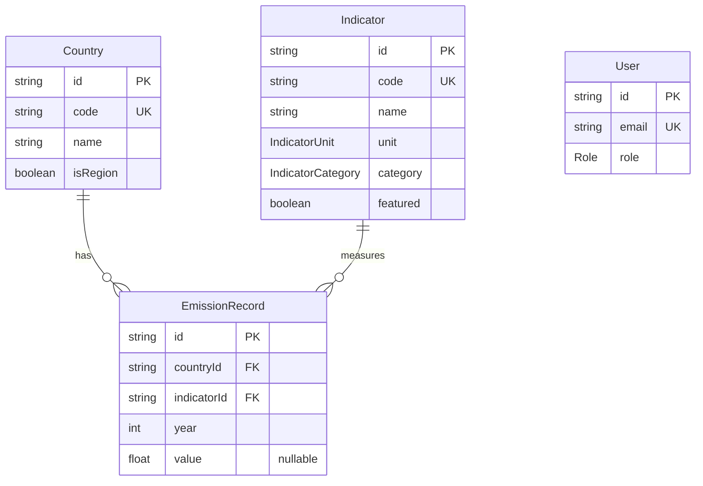

**Project:** Greenhouse Gas Emissions Dashboard & API

**Author:** Takoon

**Status:** Locked

---

# 1. Purpose

Define the database schema needed to support the assignment API, dashboard, seed data, and admin CRUD.

The model must support:

- countries list (with aggregate-region flag)
- emissions trend by country
- emissions map by year
- sector breakdown by country and year
- gas filter (CO2, CH4, N2O, total, plus HFC, PFC, SF6 from the dataset)
- admin create/update/delete for emissions and country data

---

# 2. Source Data Profile

The seed CSV is the canonical source. Schema is designed against its actual shape, not a hypothetical OWID dataset.

| Property | Value |
| --- | --- |
| Source | World Bank World Development Indicators (WDI), last updated 2024-05-30 |
| Format | Wide CSV, one row per `(country, series)` |
| Rows | 6,118 data rows (266 countries × 23 series) + 6 footer/metadata rows |
| Columns | 4 metadata + 34 years (1990–2023) = 38 total |
| Density | Most series sparse beyond 2012; data ends in 2022 for headline GHG |
| Aggregates | 16+ aggregate codes mixed with countries (WLD, EUU, OED, HIC, MIC, LIC, etc.) |

**Key implication:** Aggregate regions must be flagged but kept seedable. Hiding them by default in the dashboard does not mean dropping them from the database. A reviewer might want to query "World" to sanity-check totals.

---

# 3. Prisma Schema

```jsx
generator client {
  provider = "prisma-client-js"
}

datasource db {
  provider = "postgresql"
  url      = env("DATABASE_URL")
}

enum Role {
  VIEWER
  ADMIN
}

enum IndicatorUnit {
  KT_CO2EQ      // thousand metric tons of CO2 equivalent
  PCT_OF_TOTAL  // percentage of a fuel combustion or gas total
  PCT_CHANGE    // % change from 1990 baseline
}

enum IndicatorCategory {
  TOTAL         // headline totals (Total GHG, CO2, methane, N2O, HFC, PFC, SF6 in kt)
  GAS_PCT       // gas-specific percentages (energy methane %, agri N2O %)
  SECTOR_PCT    // CO2 sector splits as % of fuel combustion
  SECTOR_KT     // sector-level absolute tonnages (agri methane kt, energy N2O kt)
  PCT_CHANGE    // % change from 1990 indicators
}

model Country {
  id        String           @id @default(cuid())
  code      String           @unique         // ISO 3-letter (THA, USA, WLD)
  name      String
  isRegion  Boolean          @default(false) // true for WLD, EUU, OED, etc.

  emissions EmissionRecord[]

  @@index([name])
  @@index([isRegion])
}

model Indicator {
  id        String              @id @default(cuid())
  code      String              @unique      // "EN.ATM.GHGT.KT.CE"
  name      String                           // "Total greenhouse gas emissions (kt of CO2 equivalent)"
  unit      IndicatorUnit
  category  IndicatorCategory
  featured  Boolean             @default(false) // surfaced in default dashboard view

  emissions EmissionRecord[]

  @@index([category])
  @@index([featured])
}

model EmissionRecord {
  id          String     @id @default(cuid())

  countryId   String
  country     Country    @relation(fields: [countryId], references: [id], onDelete: Cascade)

  indicatorId String
  indicator   Indicator  @relation(fields: [indicatorId], references: [id], onDelete: Cascade)

  year        Int
  value       Float?

  @@unique([countryId, indicatorId, year])
  @@index([year])
  @@index([countryId, year])
  @@index([indicatorId, year])
}

model User {
  id    String @id @default(cuid())
  email String @unique
  role  Role   @default(VIEWER)
}
```

---

# 4. ER Diagram



`User` is intentionally not connected to the domain models. Auth is orthogonal to the data; admins gate writes but don't own data.

---

# 5. Indicator Catalog (from CSV)

All 23 indicators present in `data_for_test.csv`. The `featured` flag drives the default dashboard view.

## Featured (default dashboard view)

| Code | Name | Unit | Category |
| --- | --- | --- | --- |
| EN.ATM.GHGT.KT.CE | Total greenhouse gas emissions | KT_CO2EQ | TOTAL |
| EN.ATM.CO2E.KT | CO2 emissions | KT_CO2EQ | TOTAL |
| EN.ATM.METH.KT.CE | Methane emissions | KT_CO2EQ | TOTAL |
| EN.ATM.NOXE.KT.CE | Nitrous oxide emissions | KT_CO2EQ | TOTAL |
| EN.CO2.TRAN.ZS | CO2 emissions from transport | PCT_OF_TOTAL | SECTOR_PCT |
| EN.CO2.MANF.ZS | CO2 emissions from manufacturing/construction | PCT_OF_TOTAL | SECTOR_PCT |
| EN.CO2.ETOT.ZS | CO2 emissions from electricity and heat | PCT_OF_TOTAL | SECTOR_PCT |
| EN.CO2.BLDG.ZS | CO2 emissions from buildings | PCT_OF_TOTAL | SECTOR_PCT |
| EN.CO2.OTHX.ZS | CO2 emissions from other sectors | PCT_OF_TOTAL | SECTOR_PCT |

## Non-featured (queryable but not default)

| Code | Name | Unit | Category |
| --- | --- | --- | --- |
| EN.ATM.HFCG.KT.CE | HFC gas emissions | KT_CO2EQ | TOTAL |
| EN.ATM.PFCG.KT.CE | PFC gas emissions | KT_CO2EQ | TOTAL |
| EN.ATM.SF6G.KT.CE | SF6 gas emissions | KT_CO2EQ | TOTAL |
| EN.ATM.METH.AG.KT.CE | Agricultural methane (kt) | KT_CO2EQ | SECTOR_KT |
| EN.ATM.METH.EG.KT.CE | Energy sector methane (kt) | KT_CO2EQ | SECTOR_KT |
| EN.ATM.NOXE.AG.KT.CE | Agricultural N2O (kt) | KT_CO2EQ | SECTOR_KT |
| EN.ATM.NOXE.EG.KT.CE | Energy sector N2O (kt) | KT_CO2EQ | SECTOR_KT |
| EN.ATM.METH.AG.ZS | Agricultural methane | PCT_OF_TOTAL | GAS_PCT |
| EN.ATM.METH.EG.ZS | Energy related methane | PCT_OF_TOTAL | GAS_PCT |
| EN.ATM.NOXE.AG.ZS | Agricultural N2O | PCT_OF_TOTAL | GAS_PCT |
| EN.ATM.NOXE.EG.ZS | Energy sector N2O | PCT_OF_TOTAL | GAS_PCT |
| EN.ATM.GHGT.ZG | Total GHG emissions | PCT_CHANGE | PCT_CHANGE |
| EN.ATM.METH.ZG | Methane emissions | PCT_CHANGE | PCT_CHANGE |
| EN.ATM.NOXE.ZG | Nitrous oxide emissions | PCT_CHANGE | PCT_CHANGE |

---

# 6. Null Handling

The CSV uses literal `"NA"` strings for missing values. The seed parses these as `null`.

Rules:

- `null` means no value reported in the dataset
- `0` (numeric zero) means a real reported zero
- Line charts render `null` as gaps, not zeros
- Sector charts keep zero values; null sectors hidden from the chart with a footnote
- Map uses a distinct no-data color for `null` country-year cells, never blank

This rule is non-negotiable. The brief explicitly tests handling of countries with missing data.

---

# 7. Endpoint Support

How each API endpoint queries the schema. Full contracts live in `03 — API Contracts`.

## GET /api/countries

Reads `Country` where `isRegion = false` by default. Optional `?includeRegions=true`.

```tsx
type CountryOption = {
  code: string;
  name: string;
  isRegion: boolean;
};
```

## GET /api/emissions/trend?country=THA&indicator=EN.ATM.GHGT.KT.CE

Reads `EmissionRecord` joined to `Country` and `Indicator`. Defaults to total GHG emissions if indicator omitted.

```tsx
type TrendPoint = {
  year: number;
  value: number | null;
};
```

## GET /api/emissions/map?year=2020&indicator=EN.ATM.GHGT.KT.CE

Reads all `EmissionRecord` rows for one indicator and year. Excludes `isRegion = true` by default.

```tsx
type MapPoint = {
  countryCode: string;
  countryName: string;
  year: number;
  value: number | null;
};
```

## GET /api/emissions/sector?country=THA&year=2020

Reads all five SECTOR_PCT indicators for one country-year. Returns them as a single payload.

```tsx
type SectorBreakdown = {
  country: string;
  year: number;
  sectors: {
    transport: number | null;       // EN.CO2.TRAN.ZS
    manufacturing: number | null;   // EN.CO2.MANF.ZS
    electricity: number | null;     // EN.CO2.ETOT.ZS
    buildings: number | null;       // EN.CO2.BLDG.ZS
    other: number | null;           // EN.CO2.OTHX.ZS
  };
};
```

## GET /api/emissions/filter?country=THA&gas=CO2&year=2020

Maps a user-friendly gas key to an indicator code, then reads one record.

```tsx
const GAS_TO_INDICATOR = {
  TOTAL: 'EN.ATM.GHGT.KT.CE',
  CO2:   'EN.ATM.CO2E.KT',
  CH4:   'EN.ATM.METH.KT.CE',
  N2O:   'EN.ATM.NOXE.KT.CE',
  HFC:   'EN.ATM.HFCG.KT.CE',
  PFC:   'EN.ATM.PFCG.KT.CE',
  SF6:   'EN.ATM.SF6G.KT.CE',
} as const;
```

The translation lives in `lib/services/emissions.ts`, not in the route handler.

---

# 8. CRUD Rules

## Country

Required: create country.

Optional: update country, delete country.

Rules:

- `code` must be unique (3-letter ISO or aggregate code)
- `isRegion` defaults to `false`
- Deleting a country cascades its emission records (Prisma `onDelete: Cascade`)
- Admin UI exposes country deletion behind a confirm dialog

## Indicator

Required: read-only via API for the take-home. Indicators are seeded from a fixed set of 23.

Optional bonus: admin can mark/unmark `featured`.

Rationale: indicators are reference data, not user-generated. Treating them as immutable in the take-home avoids a cascade of edge cases (what happens when an indicator is renamed mid-flight?).

## EmissionRecord

Required: create, update, delete.

Rules:

- One record per `(countryId, indicatorId, year)` triple
- Duplicate combination returns `409 CONFLICT`
- Missing country or indicator returns `404 NOT_FOUND`
- Invalid payload returns `400 INVALID_PARAMS`
- Year must be between 1990 and 2030 (allows 2024-2030 forward-fill for admin entries)
- All mutating routes require ADMIN role (see `requireAdmin` in `01 — Architecture`)

---

# 9. Indexing Strategy

```jsx
// Country
@@index([name])     // for /api/countries search
@@index([isRegion]) // for default-exclude-aggregates filter

// Indicator
@@index([category]) // for "all SECTOR_PCT for sector chart"
@@index([featured]) // for default dashboard view

// EmissionRecord
@@unique([countryId, indicatorId, year]) // CRUD uniqueness
@@index([year])                          // map queries
@@index([countryId, year])               // trend queries
@@index([indicatorId, year])             // cross-country comparison by indicator
```

Tradeoff: 3 secondary indexes on `EmissionRecord` slow writes slightly. Acceptable: writes are rare (admin-only CRUD), reads dominate.

---

# 10. Seed Script Behaviour

Idempotent. Re-runs do not duplicate.

Flow:

1. Read `data_for_test.csv`
2. Skip footer rows (empty, "Data from database", "Last Updated")
3. **Upsert Country** by `Country Code`. Mark known aggregate codes as `isRegion = true` (allowlist: WLD, EUU, OED, HIC, MIC, LIC, EAP, ECS, LCN, MEA, SAS, SSF, AFE, AFW, ARB, CEB, plus any starting with non-ISO patterns)
4. **Upsert Indicator** by `Series Code`. Map name to unit and category from the catalog in §5. Mark featured indicators.
5. **For each (country, indicator, year)**: parse the year column. If value is `"NA"` or empty, treat as `null`. **Upsert EmissionRecord** by `(countryId, indicatorId, year)`.
6. Log totals: countries inserted, indicators inserted, emission records inserted, NA-skipped count.

Expected counts after seed:

- Countries: ~250 (266 codes minus duplicates and footer artifacts)
- Indicators: 23
- EmissionRecord rows: up to 266 × 23 × 34 = 208,012, with many `null` values

Performance note: insert rows in batches of 1000 with Prisma `createMany` to avoid 200k individual round-trips.

---

# 11. Decisions & Tradeoffs

Schema decision lives in `01 — Architecture` ADR-006. Domain-specific decisions follow.

## Featured indicators

Nine indicators are flagged `featured = true` in the seed and surface in the default dashboard view: total GHG, CO2, methane, nitrous oxide (all in kt CO2-eq), plus the five CO2 sector splits (transport, manufacturing, electricity, buildings, other). The remaining 14 indicators are queryable but not surfaced by default.

## Aggregate regions

All 266 country codes are seeded, including 16+ aggregate regions (WLD, EUU, OED, HIC, MIC, LIC, EAP, ECS, LCN, MEA, SAS, SSF, AFE, AFW, ARB, CEB). Aggregates are flagged `isRegion = true`. The default `/api/countries` response excludes them; clients pass `includeRegions=true` to get the full list.

## Year range in CRUD validation

Admin create/update accepts years between 1990 and 2030. The CSV ends at 2023; the extra 7 years allow forward-entry for admin demos.

---

# 12. Acceptance Criteria

Data model is ready when:

- Prisma schema migrates successfully against Neon
- Seed script idempotently loads `data_for_test.csv`
- All 23 indicators present in `Indicator` table with correct unit and category
- Aggregate regions flagged with `isRegion = true`
- `null` preserved for missing values, never coerced to 0
- `(countryId, indicatorId, year)` uniqueness enforced
- Public API endpoints in §7 return data matching their TypeScript types
- Admin CRUD has create/update/delete paths for both `Country` and `EmissionRecord`
- ER diagram in §4 matches the actual Prisma schema
